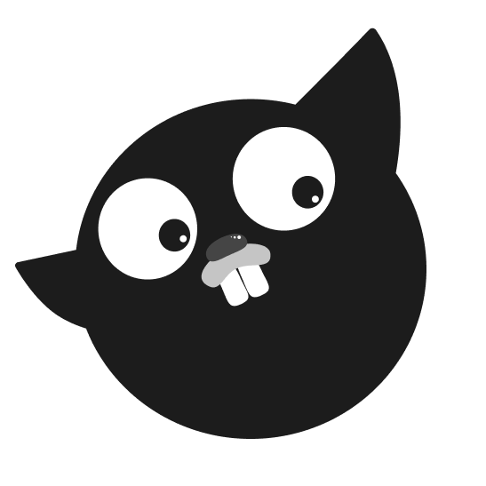

# gocat - GitOps Chat Bot Tool
## What is gocat ?
gocat provides chat interface to trigger deploy and job, AWS lambda execution.

(The Gopher character is based on the Go mascot designed by Renée French.)
